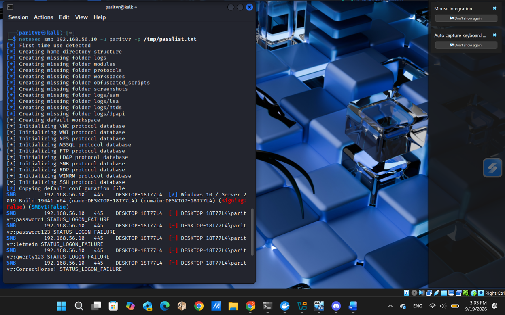

# T1110 - Brute-Force Login (SMB / NTLM)

**Host:** DESKTOP-18T77L4 (Windows VM, 192.168.56.10), local account `paritvr`
**Attacker source:** Kali VM, 192.168.56.102 (Hydra, then netexec after Hydra's SMB support failed to parse the response)
**Date/time:** 2026-09-19, 15:02:25 UTC

## Summary

An SMB password-guessing attack was run against the local account `paritvr` using Hydra and netexec. Wazuh's built-in Windows ruleset detected the activity without any custom rule, generating five Event ID 4625 ("account failed to log on") alerts. The event fields confirm a valid username with automated password guessing, network-based access, and five distinct connection attempts inside a 47-millisecond window, a timing and volume pattern that is not consistent with manual login attempts.

## Alert Summary

- **What fired:** Windows Security Event ID 4625, five times, ingested through Wazuh's default Windows ruleset. No custom rule was needed.
- **Time:** five attempts within approximately 47 milliseconds of each other (15:02:25.036 to 15:02:25.083 UTC).
- **Note:** with only five attempts, this test did not generate enough volume to also cross Wazuh's repeated-failure correlation threshold. That is expected at this scale, not a detection gap.

## Evidence

| Field | Value | What it shows |
|---|---|---|
| `subStatus` | `0xc000006a` (`STATUS_WRONG_PASSWORD`) | A valid username with an incorrect password, not username enumeration. `0xC0000064` would indicate an invalid username instead. |
| `logonType` | `3` | Network logon, matching the SMB attack vector rather than an interactive console logon. |
| `ipAddress` | `192.168.56.102` | Source is the Kali VM (its address shifted from `.20` mid-lab due to DHCP). |
| `ipPort` | 35384, 35370, 35354, 35350, 35340 | Five distinct ephemeral source ports, one per event, confirming five separate connection attempts rather than one retried session. |
| `targetDomainName` | `DESKTOP-18T77L4` | The target was a local account, not a domain account. |
| `subjectUserSid` / `targetUserSid` | `S-1-0-0` (null SID) | Expected for this failure type, since the OS never resolved a real identity before the logon failed. |

**Conclusion:** five NTLM network-logon attempts against local account `paritvr` within 47 milliseconds, each failing with `STATUS_WRONG_PASSWORD` (`0xc000006a`) from source `192.168.56.102`. The timing and volume are inconsistent with manual entry and indicate automated credential guessing.

## MITRE ATT&CK Mapping

- **Tactic:** Credential Access
- **Technique:** T1110 (Brute Force), sub-technique T1110.001 (Password Guessing)

## Impact

Successful SMB credential brute-forcing gives an attacker valid, network-reachable local-account access to the host, a foothold usable for lateral movement, file-share access, or as a stepping stone toward further privilege escalation (demonstrated separately in this lab's local-admin-account technique).

## Response

- **Detect:** alert on repeated 4625 events sharing `targetUserName` and `ipAddress` within a short window; tune the correlation threshold down if the environment expects only rare, small login-failure bursts.
- **Contain:** temporarily lock the targeted account after a set number of failures, and block the source IP at the host or network firewall.
- **Harden:** enforce a strong password and lockout policy, disable SMBv1, and restrict SMB access to known hosts or require MFA where supported.
- **Investigate:** confirm whether any attempted password eventually succeeded. In this test, none did.
